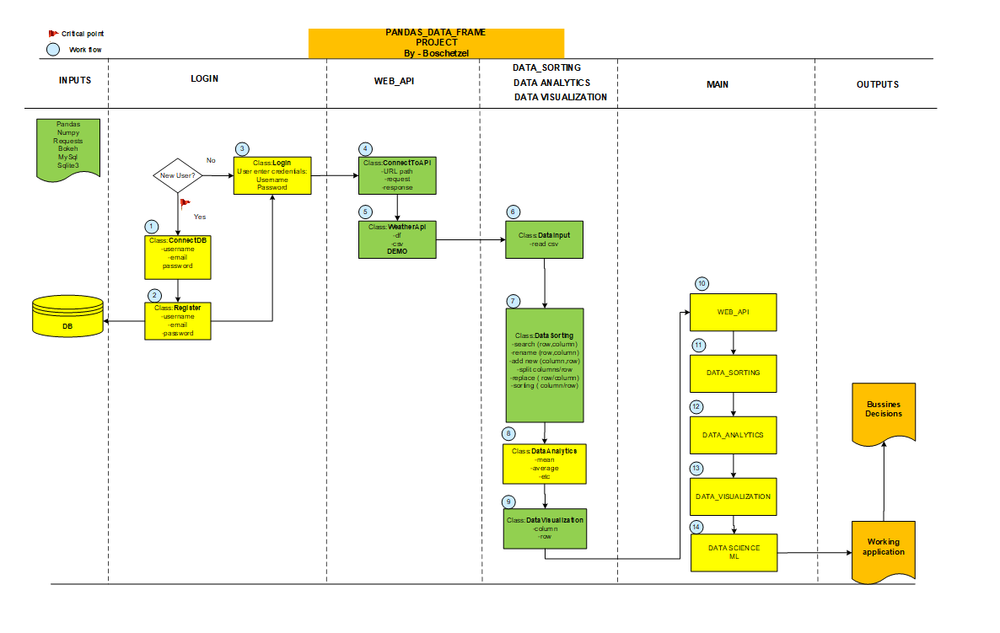

- [About](#about)
- [Demo](#demo)
- [Usage](#usage)
- [Features](#features)
- [More Info](#more-info)

## About

A Python application which allows users to open a csv file
 , **visualize**, **manipulate** and **plot  data** according to their needs using **"Pandas"**.

I used Pyqt5 to create a GUI for this project **after** the back-end code was written, 
**which was a mistake** from my part, I learned this the "hard way".

Keep in mind that the  GUI **is not design to look good.**
My goal was to put in practice the new things I learned, by coding.

Project is also **published on Pypi** under the name of : PandasDataFrame

NB: **the ML part  is not yet finished** as **I still am on a learning path with Python**.
Quick note: weather info option works only for Romania cities.

## Demo




## Usage
  Main usage of this Application:
- **Get data** from different sources (local computer or use Selenium)
- **Perform** different actions on the DataFrame
- **Analyze** the data
- **Visualize** data (plotting)


```python
#pip install PandasDataFrame==1.0.2

```

PandasDataFrame comes with **2 sample datasets** :
- Covid DataSet
- FIFA Dataset


## Features
- **Register and Login** a user based on Sqlite DB info
- **Open**/Save *.csv files (from Selenium)
- DataFrame **operations**: 
  - Data Head
  - Show Column Data,
  - Show Row Data,
  - Rename Column, 
  - Delete Column
-DataFrame a**nalysis**:
  - Add new column
  - Filter column
  - Split columns (if data have separators)
  - Select a range of columns 
- DataFrame **visualization**
  - Matplotlib 
  - Bokeh
- Get data (*.csv) using Selenium

## More Info

**Issues, feedback and pull requests are welcome.**

This project is still in version 1.0.3 and subject to further changes.

If you like this project remember to leave a ⭐! 
